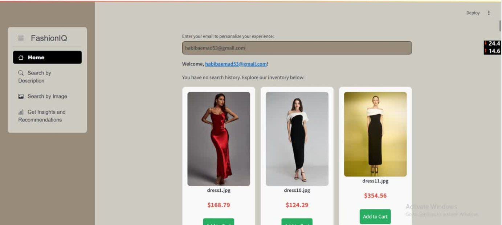
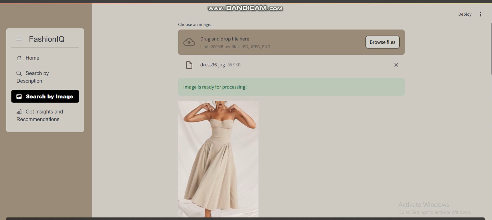
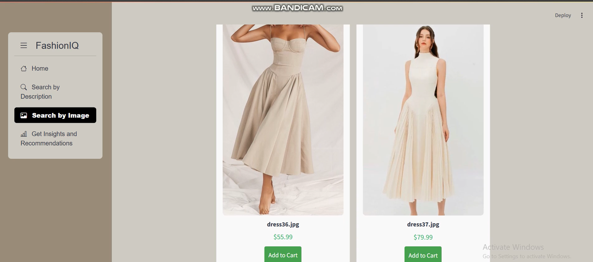
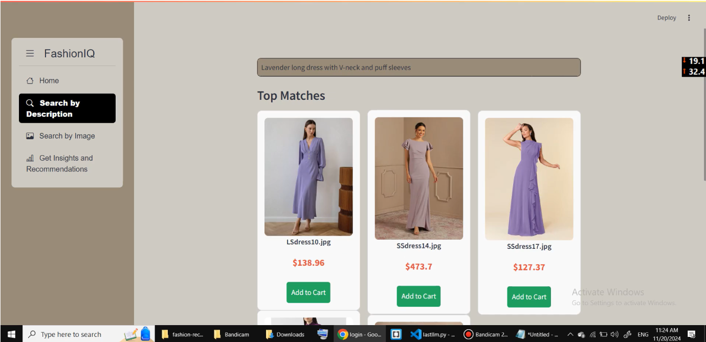

# **FashionAI: Intelligent Fashion Recommendations with Advanced Search and Insights**

## **Overview**
FashionAI is an AI-powered platform designed for fashion stores, offering advanced image and text-based search capabilities, personalized home page recommendations, and strategic insights for inventory optimization.  

---

## **Key Features**
- **Search by Image**:  
  Detects items in uploaded images using **YOLOv11** and finds visually similar items using **EfficientNet** embeddings.  
- **Search by Description-LVM**:  
  Enables users to search for fashion items using natural language queries powered by **CLIP** and **ViT-B/32**.  
- **Personalized Home Page**:  
  Designed a dynamic, personalized home page tailored to individual user preferences, enhancing customer engagement and satisfaction  
- **Strategic Insights**:  
  Integrated a fine-tuned **LLM** to analyze customer behavior and provide strategic recommendations for inventory optimization, increasing revenue and customer satisfaction  

---

### **Screenshots**
**_A screenshot of the platform's homepage._**
  
---

**_An example of the search-by-image feature._**
 
  
---

**_An example of the search-by-description feature._**
  
---

## **Demo Video**
[Watch Demo on Google Drive](https://drive.google.com/file/d/1g7Xi8-rfZL5or8CR8lp8qOKf6tTartxq/view?usp=sharing)  

